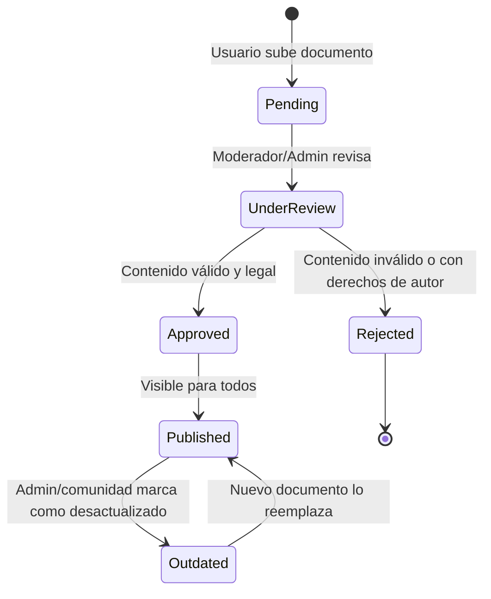

# 📐 Plan Técnico Definitivo: Clara Library
### Revisado y aprobado por el Consejo de 13 Expertos de IA — Nexo21

> **Versión:** 1.0 | **Fecha:** 12 de Abril, 2026
> **Proyecto:** Clara Library — Biblioteca Legal Digital de Venezuela
> **Ecosistema:** Nexo21 (Producto #1)

---

## 🧠 Dictamen del Consejo de Expertos

Antes del plan, cada experto emite su directriz principal:

| # | Experto | Directriz para Clara Library |
|---|---|---|
| 01 | Arquitecto Backend | Arquitectura modular. `nexo21-billing` como app Django independiente. RLS activo en Supabase. `transaction.atomic` en cada operación sensible. |
| 02 | Visionario Frontend | Dark mode por defecto. Glassmorphism sutil. Mobile-first. Paleta legal sobria pero premium (azul profundo + dorado). |
| 03 | Mago Ops | Railway para deploy. WhiteNoise para estáticos. Cloudflare como CDN. Variables via `.env`. SSL forzado. |
| 04 | Motor de Lógica | Cache de categorías y documentos populares. Separar lógica de negocio en `services.py`. Paginación a nivel de DB. |
| 05 | Limpiador de Código | Una app = una responsabilidad. Funciones < 30 líneas. SOLID aplicado desde el día 1. |
| 06 | Ninja QA | `pytest-django` desde el inicio. Test por cada flujo crítico (upload, vote, comment, payment). |
| 07 | Auditor Seguridad | OWASP Top 10 validado. Validación de todos los archivos subidos (tipo, tamaño, malware scan). CSRF en todos los formularios. |
| 08 | SEO Growth Hacker | Slugs descriptivos para cada documento. Open Graph por documento. Sitemap.xml automático. |
| 09 | Copywriter UX | Tono: profesional pero accesible. Microcopy en todos los estados vacíos. Mensajes de error humanizados. |
| 10 | Especialista Integraciones | Adapter Pattern para pagos. Abstracción de Cloudinary. Resend para emails. Webhooks validados con firma. |
| 11 | Local-First | Service Worker para caché de documentos vistos. Optimistic UI en votes y comments. |
| 12 | Doc Architect | Docstrings en formato Google. Mini-README por app. Diagramas Mermaid.js en este archivo. |
| 13 | Logging Expert | Sentry para producción. IDs de correlación en cada request. Auditoría de: uploads, aprobaciones, cambios de rol, accesos fallidos. |

---

## 🗺️ Arquitectura del Sistema

```
clara_library/
├── core/                        # Config global del proyecto Django
│   ├── settings/
│   │   ├── base.py              # Configuración compartida
│   │   ├── local.py             # Dev (SQLite local opcional)
│   │   └── production.py        # Prod (Supabase + WhiteNoise)
│   ├── urls.py                  # URL raíz
│   └── wsgi.py
│
├── apps/                        # Aplicaciones de negocio
│   ├── accounts/                # Usuarios, roles y perfiles
│   ├── library/                 # Documentos, categorías, búsqueda
│   ├── community/               # Votos, comentarios (estilo Reddit)
│   ├── tools/                   # Calculadoras laborales venezolanas
│   └── moderation/              # Panel de moderación y aprobaciones
│
├── nexo21_billing/              # Módulo reutilizable de pagos (Nexo21)
│   ├── models.py                # Plan, Subscription, Transaction
│   ├── services.py              # Lógica Binance Pay, Pago Móvil
│   ├── adapters/                # Adapter por proveedor de pago
│   │   ├── base.py
│   │   ├── binance.py
│   │   └── pagomovil.py
│   ├── decorators.py            # @requires_premium, @requires_active_plan
│   ├── webhooks.py              # Manejo de confirmaciones de pago
│   └── templates/billing/       # UI de checkout reutilizable
│
├── static/                      # CSS, JS, imágenes globales
├── templates/                   # Plantillas base (base.html, partials/)
├── media/                       # Archivos subidos (local dev)
├── logs/                        # Archivos de log locales
├── .env                         # Secretos (nunca en Git)
├── manage.py
└── requirements.txt
```

---

## 🗄️ Modelo de Datos (Esquema Principal)

```mermaid
erDiagram
    User ||--o{ Document : uploads
    User ||--o{ Comment : writes
    User ||--o{ Vote : casts
    User ||--o{ Favorite : saves
    User ||--o{ Subscription : has

    Document ||--o{ Comment : has
    Document ||--o{ Vote : receives
    Document }o--|| Category : belongs_to
    Document }o--|| User : approved_by

    Comment ||--o{ Comment : replies_to

    Plan ||--o{ Subscription : defines

    User {
        uuid id PK
        string email
        string username
        string role (visitor, user, moderator, admin)
        bool is_premium
        datetime created_at
        datetime updated_at
    }

    Document {
        uuid id PK
        string title
        string slug
        text description
        string file_url
        string file_type (pdf, image, docx, xlsx)
        string status (pending, approved, rejected)
        bool copyright_confirmed
        int vote_score
        uuid category_id FK
        uuid uploaded_by FK
        uuid approved_by FK
        datetime created_at
        datetime updated_at
    }

    Category {
        int id PK
        string name
        string slug
        string icon
        bool is_active
        datetime created_at
    }

    Comment {
        uuid id PK
        uuid document_id FK
        uuid user_id FK
        uuid parent_id FK
        text body
        int vote_score
        datetime created_at
        datetime updated_at
    }

    Vote {
        uuid id PK
        uuid user_id FK
        string target_type (document, comment)
        uuid target_id
        int value (+1 or -1)
        datetime created_at
    }

    Favorite {
        uuid id PK
        uuid user_id FK
        uuid document_id FK
        datetime created_at
    }

    Plan {
        int id PK
        string name (free, premium)
        decimal price_usd
        string billing_cycle (monthly, yearly)
        json features
    }

    Subscription {
        uuid id PK
        uuid user_id FK
        int plan_id FK
        string status (active, cancelled, expired)
        datetime starts_at
        datetime ends_at
        string payment_provider
        string payment_ref
        datetime created_at
    }
```

---

## 👥 Sistema de Roles y Permisos

```
VISITANTE (sin cuenta)
└── Puede: Leer documentos, buscar, ver categorías

USUARIO REGISTRADO (gratis)
├── Todo lo anterior +
├── Guardar favoritos
├── Comentar documentos (estilo Reddit)
├── Votar / validar documentos y comentarios
└── Subir documentos (estado: pending)

USUARIO PREMIUM (pago)
├── Todo lo anterior +
├── Calculadoras laborales (uso ilimitado)
└── Sin publicidad [futuro]

MODERADOR
├── Todo lo de usuario registrado +
├── Aprobar / rechazar documentos subidos
├── Editar categorías
└── Ocultar comentarios inapropiados

ADMIN (Tú)
└── Control total: Promover a moderador, eliminar contenido,
    ver analytics, gestionar planes y suscripciones
```

---

## 🔄 Ciclo de Vida de un Documento



---

## 📱 Flujo de Pantallas (UX Map)

```
Landing Page (/)
├── Hero: "La biblioteca legal de Venezuela"
├── Búsqueda principal (barra prominente)
├── Categorías destacadas (grid)
└── Documentos recientes / más votados

Catálogo (/documentos/)
├── Filtro por categoría, tipo, fecha
├── Ordenar por: más recientes, más votados, más descargados
└── Cards de documentos con badge de validación

Detalle Documento (/documentos/<slug>/)
├── Visor de PDF/imagen
├── Botones: Descargar, Favorito, Compartir
├── Score de validación comunitaria + botón votar
└── Sección de comentarios (Reddit-style threads)

Perfil de Usuario (/perfil/)
├── Mis documentos subidos (con estado)
├── Mis favoritos
└── Mis comentarios

Panel Moderación (/mod/)
├── Cola de documentos pendientes
├── Gestión de categorías
└── Reportes de comentarios

Panel Admin (/admin-nexo21/)   ← Panel custom (no Django admin por defecto)
├── Dashboard con métricas
├── Usuarios y roles
├── Suscripciones activas
└── Configuración global

Herramientas (/herramientas/)
├── Calculadora de Vacaciones (gratis con límite diario)
├── Calculadora de Prestaciones Sociales (gratis con límite)
├── Calculadora de Utilidades (premium)
├── Calculadora de Liquidación (premium)
└── Conversor BCV en tiempo real (gratis)
```

---

## 🔌 Integraciones Externas

| Servicio | Propósito | Plan Gratuito |
|---|---|---|
| **Supabase** | PostgreSQL + Auth + Storage | 500MB DB, 1GB storage |
| **Cloudinary** | Upload y optimización de archivos | 25GB |
| **Railway** | Hosting del servidor Django | ~$5 crédito/mes |
| **Cloudflare** | CDN + HTTPS + DDoS | Gratis |
| **Resend** | Emails transaccionales | 3,000/mes |
| **Sentry** | Logging y errores en producción | 5,000 errores/mes |
| **Binance Pay API** | Pagos en crypto (USDT) | Gratis |
| **Google Analytics** | Tráfico y comportamiento | Gratis |

---

## 🚀 Fases de Desarrollo

### FASE 1 — Fundamentos (Semanas 1-2)
- [ ] Inicializar Django (`django-admin startproject core .`)
- [ ] Configurar `settings/base.py`, `local.py`, `production.py`
- [ ] Crear archivo `.env` y conectar Supabase
- [ ] Instalar y configurar Tailwind CSS
- [ ] `app: accounts` — Registro, Login, Logout, Perfil básico
- [ ] Template base HTML con Dark Mode, navbar y footer
- [ ] Deploy inicial en Railway (CI básico)

### FASE 2 — Biblioteca (Semanas 3-4)
- [ ] `app: library` — Modelo Document, Category
- [ ] Upload de archivos a Cloudinary (con validación de tipo y tamaño)
- [ ] Checkbox de derechos de autor obligatorio
- [ ] Listado paginado de documentos con filtros
- [ ] Página de detalle con visor de PDF/imagen
- [ ] Sistema de favoritos (AJAX / htmx)
- [ ] Slugs automáticos y SEO por documento

### FASE 3 — Comunidad (Semanas 5-6)
- [ ] `app: community` — Modelo Comment (árbol) y Vote
- [ ] Comentarios anidados estilo Reddit (con htmx)
- [ ] Sistema de votación (upvote/downvote) en documentos y comentarios
- [ ] Badge de "Documento Validado" al superar X votos positivos
- [ ] Notificaciones internas (reply a comentario)

### FASE 4 — Moderación (Semana 7)
- [ ] `app: moderation` — Cola de documentos pendientes
- [ ] Vista de revisión con preview del archivo
- [ ] Aprobar / Rechazar con mensaje al usuario
- [ ] Gestión de categorías (CRUD desde panel)
- [ ] Ocultar/restaurar comentarios
- [ ] Sistema de promoción de usuarios a moderador

### FASE 5 — Herramientas (Semanas 8-9)
- [ ] `app: tools` — Calculadoras laborales
- [ ] Calculadora de Vacaciones (con límite diario para gratis)
- [ ] Calculadora de Prestaciones Sociales
- [ ] Calculadora de Utilidades
- [ ] Conversor BCV (scraping o API de BCV)
- [ ] Rate limiting por usuario para plan gratuito

### FASE 6 — Monetización (Semanas 10-11)
- [ ] `nexo21_billing` — Módulo independiente de pagos
- [ ] Adapter para Binance Pay
- [ ] Adapter para Pago Móvil (manual con comprobante)
- [ ] Gestión de suscripciones y planes
- [ ] Decorator `@requires_premium`
- [ ] Integración Google AdSense (plan gratuito)

### FASE 7 — Pulido y Producción (Semana 12)
- [ ] SEO completo (sitemap.xml, robots.txt, Open Graph)
- [ ] Sentry configurado
- [ ] Tests críticos con pytest-django
- [ ] Auditoría de seguridad (OWASP checklist)
- [ ] Optimización de queries (django-debug-toolbar)
- [ ] Documentación final

---

## 🔐 Checklist de Seguridad (Experto 07)

- [ ] `ALLOWED_HOSTS` configurado en producción
- [ ] `SECRET_KEY` en variable de entorno
- [ ] `DEBUG = False` en producción
- [ ] HTTPS forzado (`SECURE_SSL_REDIRECT = True`)
- [ ] Headers de seguridad: HSTS, CSP, X-Frame-Options
- [ ] Validación de archivos: tipo MIME real (no solo extensión), tamaño máximo 20MB
- [ ] Rate limiting en login (django-ratelimit)
- [ ] RLS habilitado en Supabase
- [ ] Sanitización de comentarios (anti-XSS)
- [ ] CSRF token en todos los formularios

---

## 📊 KPIs a Medir (Experto 08 + 13)

| Métrica | Herramienta | Meta 6 meses |
|---|---|---|
| Usuarios registrados | Google Analytics | 500 |
| Documentos aprobados | Dashboard interno | 200 |
| DAU (usuarios activos/día) | Analytics | 100 |
| Tiempo de carga promedio | Cloudflare | < 2 segundos |
| Ratio conversión premium | Dashboard | 3-5% |
| Errores en producción | Sentry | < 5 críticos/semana |

---

*Plan elaborado con el Consejo de 13 Expertos de IA — Nexo21 Ecosystem*
*Próxima revisión: Al completar Fase 1*
